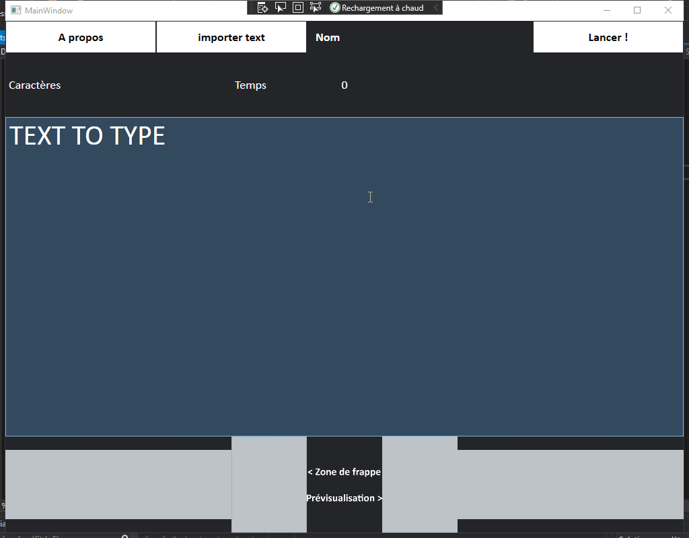

### What is DactyloLibre about?
DactyloLibre is fun and easy to use! However, this program is in its first version. I'm open for advice, suggestions on how to improve this program, evaluations, etc..

#### Demo
This video is only a demo, this is not necessarily the currenct code source.
   
 
#### Questions?
- [You can post it there](https://github.com/spoutnik911/DactyloLibre-CsharpVersion/labels/question)

#### If you know how to do any of the following listed below or are willing to help, you are welcome to do so.
* [Improvement advices](https://github.com/spoutnik911/DactyloLibre-CsharpVersion/labels/enhancement)
* [Bugs repports](https://github.com/spoutnik911/DactyloLibre-CsharpVersion/labels/bug)
* [Creations helps](https://github.com/spoutnik911/DactyloLibre-CsharpVersion/pulls)
  * Media
    * Images (PNG)
      1. Logo for the project webpage
      2. Logo for the exe
      3. ... what else ?
    * Colors advises for the user interface
    * Sound (I don't know)
    * [Create, edit the wiki](https://github.com/spoutnik911/DactyloLibre-CsharpVersion/wiki)
  * Code with explainations (for understanding and improving myself)
    * Code implementation suggestions
    * Debug
    * [Translations](https://github.com/spoutnik911/DactyloLibre-CsharpVersion/tree/master/bin_res)
